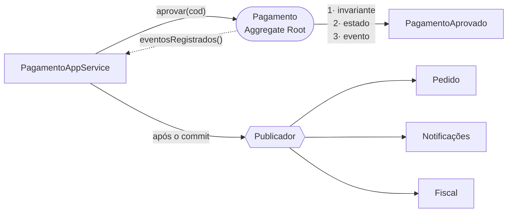

<div align="center">


# 📣 Domain Events · Contexto de Pagamento

**O agregado decide, registra o que aconteceu e não sabe quem vai ouvir**

<sub>DR4-TP2 · Bloco Engenharia de Softwares Escaláveis · Trabalho individual</sub>

<br/>

[](#-stack)
[](#-stack)
[](#-stack)
[](#-evidências)
[](#-o-desenho-do-evento)
[](LICENSE)

</div>

---

## 💡 Visão geral

Este repositório continua o [DR4-TP1](https://github.com/andrebecker84/ecommerce-ddd-refactoring-TP1),
onde o **Contexto Delimitado de Pagamento** foi extraído de um monólito de e-commerce. O agregado
`Pagamento` já estava lá: com invariantes próprias, referenciando `Pedido` e `Usuario` apenas por
identidade, sem uma linha de outro contexto atravessando a fronteira.

O TP2 acrescenta a peça que faltava: **eventos de domínio**. Quando um pagamento é aprovado, o
agregado deixa de apenas mudar o próprio estado: ele **registra um fato**, `PagamentoAprovado`,
que a camada de aplicação publica depois do commit. Quem reage, seja Pedido, Notificações ou
Fiscal, não é problema do domínio.

> **Disciplina:** Domain-Driven Design (DDD) e Arquitetura de Softwares Escaláveis com Java  
> **Professor:** Leonardo Silva da Gloria  
> **Aluno:** André Luis Becker  
> **Trabalho:** Individual  
> **Trimestre:** 26E3

---

## 🎯 A decisão central

**O agregado acumula; a aplicação publica.**



`Pagamento` não conhece publicador, broker nem Spring. Ele guarda o evento numa lista interna e
segue POJO puro. É a leitura ortodoxa do padrão: o domínio descreve o que aconteceu, a
infraestrutura decide como isso viaja.

E a publicação acontece **depois do commit**, porque evento de algo que não foi persistido é pior
que evento nenhum.

---

## 🏗️ O contexto

| Peça | Papel |
|---|---|
| `Pagamento` | **Aggregate Root**: invariantes, transições de estado e registro de eventos |
| `PagamentoId` · `Dinheiro` · `NumeroCartao` | **Value Objects** imutáveis e autovalidados |
| `StatusPagamento` · `FormaPagamento` · `MotivoRecusa` | **Enums** no lugar das strings soltas |
| `EventoDeDominio` | **Abstração** que padroniza o contrato de todo evento |
| `PagamentoAprovado` · `PagamentoRecusado` | **Eventos concretos**, imutáveis e nomeados no passado |
| `PagamentoRepositorio` · `ProcessadorCartao` · `PublicadorDeEventos` | **Portas de saída** declaradas pelo domínio |
| `PagamentoAppService` | **Serviço de aplicação**: orquestra, drena os eventos, não decide |
| `PublicadorDeEventosSpring` | **Adaptador de saída**: a única classe que conhece o mecanismo de entrega |
| `NotificacaoDePagamento` | **Consumidor de exemplo**, reagindo `AFTER_COMMIT` |

Três regras sustentam a fronteira: o pacote `domain` é POJO puro, sem `import` de Spring ou JPA;
outros agregados são referenciados por identidade (`long pedidoId`, nunca `Pedido pedido`); e o
contrato de integração trafega só primitivos.

> [!IMPORTANT]
> O contexto **não acessa** `UsuarioRepository`, `ProdutoRepository`, `EstoqueRepository` nem
> `PedidoRepository`. Não é convenção: o `FronteiraDoContextoTest` lê o código-fonte e quebra o
> build se acontecer.

---

## 🧾 O desenho do evento

Um evento de domínio é **fato consumado**: nome no passado, imutável, com identidade própria e
momento de ocorrência.

| Propriedade | Por quê |
|---|---|
| Nome no passado (`PagamentoAprovado`) | Descreve o que **já** aconteceu, não um comando a executar |
| Identidade (`UUID`) | Permite deduplicar, já que o mesmo evento pode chegar duas vezes |
| Momento (`Instant`) | Ordena os fatos, independe de quando foram entregues |
| Identificador do agregado de origem | Diz de quem é o fato, sem carregar o agregado junto |
| Imutável e serializável | Quem consome está fora da transação, às vezes fora do processo |

---

## 🧰 Stack

| Item | Versão | Papel no projeto |
|---|:---:|---|
| Java | 25 | `record` nos eventos e nos Value Objects, `List.copyOf` no agregado |
| Maven | 3.6.3+ | build e execução da suíte |
| Spring Boot | 4.1.0 | contexto da aplicação e autoconfiguração |
| Spring Web | pelo BOM do Boot | os endpoints REST e o `RestClient` do adaptador remoto |
| Spring Data JPA | pelo BOM do Boot | persistência do agregado, isolada em `infrastructure` |
| Spring Context e TX | pelo BOM do Boot | `ApplicationEventPublisher` e `@TransactionalEventListener` |
| H2 | em memória | banco do ambiente de estudo, sem credencial versionada |
| Bean Validation | pelo BOM do Boot | validação na borda, antes de chegar ao domínio |
| JUnit 5 | pelo BOM do Boot | os 28 testes, sem contexto Spring nos de domínio |

O pacote `domain` **não usa nada desta tabela**: é Java puro, e um teste quebra o build se um
`import` de Spring ou de JPA aparecer ali dentro.

| Padrão | Onde aparece |
|---|---|
| Aggregate Root | `Pagamento`, dono das invariantes e do registro dos fatos |
| Value Object | `PagamentoId`, `Dinheiro`, `NumeroCartao` |
| Bounded Context | o pacote `pagamento`, com fronteira verificada por teste |
| **Domain Events** | `EventoDeDominio`, `PagamentoAprovado`, `PagamentoRecusado` |
| Ports & Adapters | `PagamentoRepositorio`, `ProcessadorCartao`, `PublicadorDeEventos` |

---

## 🚀 Como executar

Requer **JDK 25** e **Maven 3.6.3+**.

```bash
mvn test
```

```bash
mvn spring-boot:run
```

API em `http://localhost:8080`, console H2 em `/h2-console`. As credenciais do banco vêm de
`DB_USERNAME` e `DB_PASSWORD`; sem variáveis definidas, valem os padrões do H2 em memória.
Para exercitar as regras, use [`requests.http`](requests.http).

> [!IMPORTANT]
> Não versione senhas, tokens, `.env` ou dados pessoais reais. Este projeto usa H2 em memória e
> não tem credencial versionada. Os números de cartão dos exemplos são valores de teste públicos.

---

## 📊 Evidências

```text
[INFO] Tests run: 28, Failures: 0, Errors: 0, Skipped: 0
[INFO] BUILD SUCCESS
```

Dezessete testes herdados do TP1: as cinco regras de pagamento, o cartão ilegível, as transições
do agregado, os Value Objects e as duas travas de fronteira.

Sete do **registro** no agregado: aprovação e recusa registram o fato certo, a recusa imediata já
nasce com ele, a lista devolvida é cópia imutável, `limparEventos()` esvazia e, o mais importante,
**invariante violada não registra evento**: aprovar duas vezes falha e o fato continua único.

Quatro da **publicação**: o evento certo sai uma única vez, com o motivo na recusa, o agregado fica
limpo depois e a publicação acontece **na ordem certa**, primeiro persistir e só então publicar.

---

## 🗂️ Estrutura

```text
.
├── docs/context/                       ← enunciado e rúbrica (fonte de verdade acadêmica)
├── docs/evidences/                     ← prints das questões 6, 7, 9 e 10
├── src/main/java/br/edu/infnet/ecommerce/
│   ├── pagamento/                      ← CONTEXTO DELIMITADO
│   │   ├── domain/                     ← agregado, VOs, enums, portas (POJO puro)
│   │   │   └── evento/                 ← EventoDeDominio, eventos concretos, porta de publicação
│   │   ├── application/                ← serviço de aplicação: persiste, drena, publica
│   │   └── infrastructure/             ← JPA, processador de cartão, REST, publicador
│   ├── notificacao/                    ← consumidor de exemplo (AFTER_COMMIT)
│   ├── pedido/pagamento/               ← contrato de integração + 2 adaptadores
│   └── controller/ service/ entity/…   ← monólito remanescente
├── src/test/java/…/pagamento/          ← regras, eventos e trava de fronteira
├── requests.http
└── LICENSE                             ← código visível, direitos reservados
```

---

## 📄 Documentação

As 14 questões fazem parte do documento de entrega, submetido em PDF diretamente ao professor e
**não publicado neste repositório**. O enunciado e a rúbrica estão em
[`docs/context/`](docs/context/). Onde o enunciado original diz "Pet Friends", este trabalho usa o
projeto **E-commerce** do TP1.

---

## ⚖️ Licença e uso acadêmico

Código visível, **todos os direitos reservados**. Veja [`LICENSE`](LICENSE).

Você pode ler, executar e aprender com este código, e citá-lo com atribuição. **Não** pode
apresentá-lo como produção própria em qualquer avaliação, redistribuí-lo ou usá-lo comercialmente.

O projeto deriva de [`leoinfnet/ecommerce-legado-ddd`](https://github.com/leoinfnet/ecommerce-legado-ddd),
de Leonardo Silva da Gloria, usado como base por orientação docente. Aquele projeto não declara
licença, e os direitos sobre o código original permanecem com o seu autor.

> [!WARNING]
> Projeto didático. O processador de cartão é **simulado**, o banco é em memória e o código **não
> se destina a processar pagamentos reais**.

---

<div align="center">

<sub>Instituto Infnet · Escola Superior de Tecnologia da Informação · 2026</sub>


</div>
