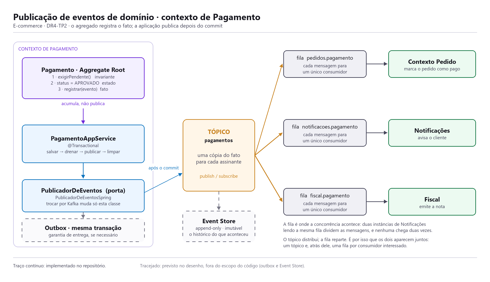

# DR4-TP2 — Agregados e Domain Events

>**Disciplina:** Domain-Driven Design (DDD) e Arquitetura de Softwares Escaláveis com Java  
**Professor:** Leonardo Silva da Gloria  
**Aluno:** André Luis Becker  
**Trabalho:** Individual  
**Trimestre:** 26E3  

> **Nota de escopo.** Onde o enunciado original diz "projeto Pet Friends", este trabalho usa o
> projeto **E-commerce** desenvolvido no DR4-TP1, a extração do Contexto Delimitado de Pagamento
> de um monólito. Apenas o nome do projeto muda; as questões e a rúbrica são as do enunciado.

---

## 1. Explique de forma sucinta qual a razão de criar Agregados.

O agregado existe para responder até onde vai a regra. Ele reúne objetos que só fazem sentido
juntos e elege um deles como porta de entrada, a *Aggregate Root*: nada de fora fala com as peças
internas.

Isso resolve três coisas de uma vez. As invariantes ficam **num lugar só**, garantidas por quem é
dono delas, em vez de espalhadas por vários *services*. A transação ganha um tamanho natural, um
agregado, o que reduz bloqueio e contenção. E a carga fica limitada ao que a operação precisa, sem
arrastar pedido, itens e produtos atrás de si.

No e-commerce, `Pagamento` é a raiz de um agregado pequeno: ele e seus Objetos de Valor
(`Dinheiro`, `NumeroCartao`, `PagamentoId`). Pedido e Usuário ficam de fora, e foi essa decisão que
permitiu mover o contexto inteiro para outro processo no TP1 sem reescrever o domínio.

Pequeno é a palavra certa, e é uma escolha, não um acaso. O agregado **não tem coleção nenhuma**:
não guarda lista de tentativas, de itens ou de recibos. Sem coleção não há carregamento preguiçoso
para acertar, nem decisão sobre carregar tudo ou só parte, nem o crescimento silencioso que faz um
agregado virar meio banco de dados com o tempo. A única lista que existe, a de eventos, é
transitória: nasce na operação, é drenada pelo serviço de aplicação e nunca chega à persistência.

---

## 2. O que significa "consistência transacional"?

Que ao fim da transação **todas as regras do modelo continuam válidas**, e que ninguém de fora
enxerga um estado pela metade. É o "tudo ou nada" aplicado às invariantes, não só aos dados: se
aprovar um pagamento envolve mudar o status, gravar o código de autorização e registrar o momento,
ou as três coisas valem juntas ou nenhuma vale. Não existe pagamento aprovado sem código.

No projeto, `PagamentoAppService.processar(...)` é `@Transactional` e trata **um único agregado**.
Essa é a regra prática: consistência transacional vale **dentro** do agregado. Entre agregados
diferentes ela é **eventual** — o Pedido descobre que foi pago quando o evento chega, instantes
depois. Exigir consistência transacional entre os dois obrigaria a uma transação sobre ambos, que é
exatamente o acoplamento que o agregado veio evitar.

Vale acompanhar o que acontece quando dá errado, porque é aí que a diferença aparece. Se o `salvar`
falhar depois de o processador ter autorizado a cobrança, a transação sofre *rollback*: o pagamento
não existe no banco e o evento **não é publicado**, porque o consumidor só escuta `AFTER_COMMIT`.
Já se o pagamento for gravado e o contexto de Pedido estiver fora do ar, o pagamento continua
válido e o pedido fica temporariamente desatualizado, inconsistência que se resolve quando aquela
fila voltar a ser processada. Uma falha invalida o fato; a outra apenas atrasa quem precisa dele.

---

## 3. Cite as 4 propriedades cruciais que definem transações.

**ACID:**

| Propriedade | O que garante |
|---|---|
| **A**tomicidade | A transação acontece por inteiro ou não acontece. Não há metade aplicada. |
| **C**onsistência | O banco sai de um estado válido para outro estado válido, respeitando as regras declaradas. |
| **I**solamento | Transações simultâneas não enxergam o trabalho incompleto umas das outras. |
| **D**urabilidade | Depois do commit, o resultado sobrevive, inclusive a uma queda imediata do processo. |

As quatro aparecem no `POST /pagamentos` do projeto, e não só na teoria:

- **atomicidade** é o que faz status, código de autorização e momento do processamento valerem
  juntos, sem pagamento aprovado sem código;
- **consistência** aqui tem dois guardiões, o banco, com suas restrições de coluna, e o agregado,
  que recusa qualquer transição que viole uma invariante;
- **isolamento** é o que impede que duas requisições simultâneas para o mesmo pedido aprovem o
  pagamento duas vezes: a segunda encontra o estado já mudado e `exigirPendente()` a rejeita;
- **durabilidade** é o que sustenta publicar eventos **depois do commit**, porque antes dele não
  há garantia nenhuma de que o fato aconteceu.

---

## 4. O que são "invariantes de negócio"?

São as regras que precisam ser verdadeiras **sempre**, e não apenas durante a execução de um
método: toda vez que o agregado estiver em repouso, pronto para ser lido ou salvo.

Não se confundem com validação de entrada. Validação diz se um dado recebido é aceitável;
invariante diz se o objeto pode existir naquele estado.

As invariantes do `Pagamento`, todas garantidas dentro dele:

- só pode ser **aprovado ou recusado uma vez**, e quem tenta de novo recebe `IllegalStateException`;
- todo aprovado **tem** código de autorização; toda recusa **tem** motivo;
- valor e cartão são válidos por construção, porque são Objetos de Valor autovalidados;
- a política de valor, forma e limite é avaliada **antes** de qualquer chamada externa, o que evita
  gastar uma ida ao provedor de cartão com um pagamento que já se sabe recusado.

---

## 5. Porque um agregado só deve ter acesso a outro agregado pelo ID?

Porque a referência direta desfaz o que a fronteira construiu. Se `Pagamento` guardasse
`Pedido pedido` em vez de `long pedidoId`:

1. **A fronteira transacional vazaria.** Com o objeto em mãos, é questão de tempo até alguém chamar
   `pedido.marcarComoPago()` dentro da transação do pagamento, alterando dois agregados juntos.
2. **A carga cresceria sem controle.** Carregar um pagamento passaria a carregar pedido, itens e
   produtos. O grafo não tem fim natural.
3. **A concorrência pioraria.** Dois agregados no mesmo bloqueio significam mais contenção entre
   operações que não têm relação nenhuma.
4. **A separação física ficaria impossível.** Uma classe de outro contexto no classpath impede que
   o contexto vire processo próprio; com o identificador, isso é configuração.

No projeto a regra não depende de disciplina: `FronteiraDoContextoTest` lê o código-fonte do pacote
`pagamento` e **quebra o build** se aparecer referência a `PedidoRepository`, `UsuarioRepository`,
`ProdutoRepository` ou `EstoqueRepository`.

---

## 6. Crie um trecho de código Java de uma entidade que represente um agregado e faça referência a outro agregado dentro do escopo do projeto E-commerce.

`Pagamento` é a raiz do agregado. `Pedido` e `Usuario` são outros agregados, referenciados apenas
por identidade:

```java
public class Pagamento {

    private final PagamentoId id;
    private final long pedidoId;     // outro agregado: referência por identidade
    private final long usuarioId;    // outro agregado: referência por identidade
    private final Dinheiro valor;
    private final FormaPagamento forma;
    private final String cartaoMascarado;
    private final LocalDateTime criadoEm;

    private StatusPagamento status;
    private MotivoRecusa motivo;
    private String codigoAutorizacao;
    private LocalDateTime processadoEm;

    /** Fatos ocorridos neste agregado e ainda não publicados. */
    private final List<EventoDeDominio> eventos = new ArrayList<>();

    /** Única forma de criar um pagamento novo. */
    public static Pagamento solicitar(long pedidoId, long usuarioId, Dinheiro valor,
                                      FormaPagamento forma, NumeroCartao cartao) {
        Objects.requireNonNull(cartao, "cartão é obrigatório");
        return new Pagamento(PagamentoId.novo(), pedidoId, usuarioId, valor, forma,
                cartao.mascarado(), StatusPagamento.PENDENTE, LocalDateTime.now());
    }
}
```

Três detalhes intencionais: os identificadores são `long`, e não objetos; a identidade própria usa
um tipo dedicado (`PagamentoId`), o que impede passar um id de pedido onde se espera um de
pagamento; e o construtor é privado, com criação só por fábrica nomeada, de modo que não existe
pagamento pela metade.

**Arquivo:** `src/main/java/br/edu/infnet/ecommerce/pagamento/domain/Pagamento.java`

---

## 7. Elabore um trecho de código Java que mostre um método de negócio com a previsão de publicação de um evento de domínio dentro do escopo do projeto E-commerce.

O método acontece em três etapas, **nesta ordem**: a invariante decide, o estado muda, e só então o
fato é registrado.

```java
public void aprovar(String codigoAutorizacao) {
    exigirPendente();                                                          // 1. invariante

    this.codigoAutorizacao = Objects.requireNonNull(
            codigoAutorizacao, "código de autorização é obrigatório na aprovação");
    this.status = StatusPagamento.APROVADO;                                    // 2. estado
    this.processadoEm = LocalDateTime.now();

    registrar(PagamentoAprovado.de(id, pedidoId, usuarioId, valor,             // 3. evento
            this.codigoAutorizacao));
}

private void exigirPendente() {
    if (status != StatusPagamento.PENDENTE) {
        throw new IllegalStateException("Pagamento já processado: " + id);
    }
}

/** Fatos ocorridos e ainda não publicados, em ordem de ocorrência. */
public List<EventoDeDominio> eventosRegistrados() {
    return List.copyOf(eventos);
}

/** Descarta os eventos já publicados pelo serviço de aplicação. */
public void limparEventos() {
    eventos.clear();
}
```

A ordem não é estética: registrar antes de validar anunciaria uma aprovação que pode não acontecer,
e registrar antes de mudar o estado descreveria um estado que ainda não existe.

**"Previsão de publicação" aqui é literal: o agregado não publica.** Ele acumula os fatos e segue
POJO puro, sem conhecer publicador, fila ou tópico. Quem drena e despacha é o serviço de aplicação,
depois que a transação confirma:

```java
private void publicarEventos(Pagamento pagamento) {
    List<EventoDeDominio> eventos = pagamento.eventosRegistrados();
    if (eventos.isEmpty()) {
        return;
    }
    publicador.publicar(eventos);
    pagamento.limparEventos();
}
```

Um teste protege a ordem: aprovar duas vezes estoura `IllegalStateException` **e a lista continua
com um único fato**, porque invariante violada não registra evento.

**Arquivo:** `src/main/java/br/edu/infnet/ecommerce/pagamento/domain/Pagamento.java`

---

## 8. O que é "evento de domínio"?

É o registro de **algo relevante que já aconteceu**, publicado para que outras partes do sistema
possam reagir. Não é pedido de ação: é notícia de fato consumado. A diferença para um comando está
no tempo verbal, e não é detalhe — `AprovarPagamento` é um pedido, que pode ser recusado;
`PagamentoAprovado` é um fato, que já ocorreu. Quem publica não sabe quem vai ouvir.

**Anatomia**, como o projeto implementa:

| Elemento | Papel |
|---|---|
| Identidade própria (`UUID`) | Distinta da identidade do agregado. Permite deduplicar quando a mesma mensagem chega duas vezes. |
| Momento da ocorrência (`Instant`) | Quando o fato aconteceu, não quando foi entregue. Sem ele, a ordem se perde no transporte. |
| Identificador do agregado de origem | De quem é o fato, por identidade, nunca o agregado inteiro. |
| Dados do fato | O mínimo que os interessados precisam: pedido, usuário, valor, código de autorização. |
| Nome no passado | Convenção que deixa explícito que aquilo é fato, não comando. |

Três propriedades vêm junto: o evento é **imutável**, nasce completo e não muda; é
**serializável**, porque pode atravessar processo; e é **parte da linguagem ubíqua**, já que
"pagamento aprovado" é o que o negócio diz.

---

## 9. Crie um trecho de código Java que mostre uma abstração de um objeto do tipo "evento de domínio".

```java
public interface EventoDeDominio {

    /** Identidade do evento, que permite deduplicar na entrega. */
    UUID eventoId();

    /** Momento em que o fato ocorreu, em UTC. */
    Instant ocorridoEm();

    /** Identificador do agregado que originou o fato. */
    String agregadoId();

    /**
     * Nome do fato, usado como chave de roteamento na publicação.
     * O padrão é o nome simples da classe. Se um dia o evento cruzar processo,
     * é aqui que entra a versão do contrato (por exemplo, PagamentoAprovado.v2).
     */
    default String nome() {
        return getClass().getSimpleName();
    }
}
```

Escolhi **interface**, e não classe abstrata, por um motivo prático: assim as implementações podem
ser `record`, o que já dá imutabilidade, `equals`, `hashCode` e construtor canônico, que é
exatamente o que um evento precisa. Classe abstrata forçaria herança e impediria o `record`.

**Arquivo:** `src/main/java/br/edu/infnet/ecommerce/pagamento/domain/evento/EventoDeDominio.java`

---

## 10. Crie um trecho de código Java que mostre a implementação de um "evento de domínio" dentro do escopo do projeto E-commerce.

```java
public record PagamentoAprovado(UUID eventoId,
                                Instant ocorridoEm,
                                String agregadoId,
                                long pedidoId,
                                long usuarioId,
                                BigDecimal valor,
                                String moeda,
                                String codigoAutorizacao) implements EventoDeDominio {

    public PagamentoAprovado {
        Objects.requireNonNull(eventoId, "eventoId é obrigatório");
        Objects.requireNonNull(ocorridoEm, "ocorridoEm é obrigatório");
        Objects.requireNonNull(agregadoId, "agregadoId é obrigatório");
        Objects.requireNonNull(valor, "valor é obrigatório");
        Objects.requireNonNull(moeda, "moeda é obrigatória");
        Objects.requireNonNull(codigoAutorizacao, "código de autorização é obrigatório");
    }

    /** Fábrica usada pelo agregado no momento da aprovação. */
    public static PagamentoAprovado de(PagamentoId pagamentoId, long pedidoId, long usuarioId,
                                       Dinheiro valor, String codigoAutorizacao) {
        return new PagamentoAprovado(
                UUID.randomUUID(),
                Instant.now(),
                pagamentoId.toString(),
                pedidoId,
                usuarioId,
                valor.valor(),
                valor.moeda().getCurrencyCode(),
                codigoAutorizacao);
    }
}
```

Três decisões de contrato:

- **carrega primitivos, não os Objetos de Valor do domínio**, porque quem consome pode estar em
  outro processo, escrito em outra linguagem, e um contrato que exige as classes deste pacote no
  classpath não atravessa essa fronteira. A conversão fica na fábrica;
- **o número do cartão não viaja**, nem mascarado, porque evento vai para tópico e é lido por quem
  se inscrever;
- **existe o par `PagamentoRecusado`**, com a mesma interface, que é o que mostra que a abstração
  padroniza de fato e não foi escrita para um caso só.

**Arquivo:** `src/main/java/br/edu/infnet/ecommerce/pagamento/domain/evento/PagamentoAprovado.java`

---

## 11. Qual é a diferença entre filas e tópicos e como estes elementos funcionam em conjunto?

A diferença está em **quantos recebem cada mensagem**.

| Critério | Fila (*queue*) | Tópico (*topic*) |
|---|---|---|
| Modelo | Ponto a ponto | Publicação / assinatura |
| Quem recebe | **Um** consumidor por mensagem | **Todos** os assinantes, cada um com sua cópia |
| Vários consumidores | Dividem o trabalho (*competing consumers*) | Cada um recebe tudo |
| Serve para | Distribuir carga | Distribuir informação |
| Efeito de somar consumidor | Processa mais rápido | Passa a processar mais vezes |

Em números: dez mensagens e três consumidores dão dez processamentos numa fila e trinta entregas
num tópico. A fila **reparte**, o tópico **distribui**.

Os dois trabalham juntos no arranjo padrão da mensageria: **um tópico e, atrás dele, uma fila por
consumidor interessado**. O publicador entrega uma vez ao tópico, que coloca uma cópia na fila de
cada assinante; dentro de cada fila o paralelismo acontece sem duplicar trabalho. Assim quem quer o
fato recebe o fato, e cada interessado o processa uma vez só, na velocidade que aguentar. De
quebra, isola falhas: se Notificações parar, sua fila acumula enquanto Pedido e Fiscal seguem.

No projeto, o `ApplicationEventPublisher` do Spring faz o papel do tópico dentro de um processo só:
entrega a todos os interessados, e nenhum deles é conhecido pelo publicador.

---

## 12. Dê um exemplo de solução de arquitetura para publicação de eventos de domínio dentro do escopo do projeto E-commerce (ideal um desenho).



O fluxo, da esquerda para a direita:

1. **O agregado registra.** `Pagamento.aprovar(...)` valida a invariante, muda o estado e guarda
   `PagamentoAprovado` numa lista interna, sem conhecer publicador nem broker.
2. **O serviço de aplicação drena.** Dentro da transação, persiste o agregado, entrega os fatos à
   porta de publicação e limpa a lista.
3. **O adaptador publica, depois do commit.** `PublicadorDeEventosSpring` é a única classe do
   contexto que conhece o mecanismo de entrega; trocá-la por um produtor de Kafka, RabbitMQ ou SNS
   não muda uma linha do agregado nem do serviço, e é isso que a porta `PublicadorDeEventos`
   garante.
4. **O tópico `pagamentos` distribui** uma cópia do fato para cada assinante.
5. **Cada consumidor tem sua fila.** Pedido marca o pedido como pago, Notificações avisa o cliente,
   Fiscal emite a nota. Somar um quarto interessado é criar mais uma assinatura.

**Por que depois do commit.** O consumidor de exemplo usa
`@TransactionalEventListener(phase = AFTER_COMMIT)`. Se a transação sofrer *rollback*, o aviso não
sai, o que evita o pior defeito desse tipo de integração: contar ao cliente uma aprovação que o
banco desfez. O preço é entrega "no máximo uma vez", já que commit seguido de queda do processo
perde o aviso.

**As peças tracejadas.** Quando essa perda for inaceitável, entra o padrão **outbox**: gravar o
evento numa tabela dentro da mesma transação e deixar um processo separado publicá-lo, repetindo
até confirmar. A **Event Store**, ao lado do tópico, guarda o histórico. Nenhuma das duas está
implementada no repositório, e por isso aparecem tracejadas no desenho.

---

## 13. Explique qual a finalidade de uma Event Store no contexto de eventos de domínio.

É o repositório onde os eventos ficam **guardados como registro histórico**, e não apenas
transportados. Um banco *append-only*: eventos são acrescentados, nunca alterados nem apagados.

A imutabilidade é o ponto. Uma tabela comum responde "qual é o estado agora" e perde o caminho a
cada `UPDATE`; a Event Store responde "o que aconteceu, em que ordem", e essa resposta não muda
depois, o que a torna fonte confiável de auditoria.

No e-commerce ela serve para **auditar**, já que toda tentativa de pagamento fica registrada com
valor, motivo e momento, e uma contestação passa a ter resposta exata; para **reprocessar**, porque
um consumidor que caiu ou que foi corrigido depois de um defeito relê os eventos e recompõe o que
perdeu; para **criar leituras novas sobre o passado**, alimentando com eventos antigos um relatório
criado hoje; e para **sustentar Event Sourcing**, quando os eventos passam a ser a fonte da verdade.

Vale distinguir do que se parece: não é log técnico, que serve a diagnóstico e é descartável, nem
backup, que é cópia do estado. A Event Store guarda **fatos de negócio**, na linguagem do domínio.

---

## 14. O que é Event Sourcing e como ele se diferencia da persistência tradicional em bancos de dados relacionais? Explique como os eventos salvos são usados para recuperar o estado atual de um Agregado.

É o padrão em que a fonte da verdade deixa de ser o estado atual e passa a ser a **sequência de
eventos** que o produziu. Não se grava "como o pagamento está", e sim "o que aconteceu com ele", em
ordem.

| Critério | Persistência tradicional | Event Sourcing |
|---|---|---|
| O que é gravado | O estado atual | Os fatos, em sequência |
| Efeito de uma mudança | `UPDATE` sobrescreve | `INSERT` acrescenta |
| Histórico | Perdido, salvo se houver auditoria à parte | É o próprio armazenamento |
| Estado atual | Lido direto da linha | Derivado dos eventos |
| Consulta | Direta, com SQL | Exige projeções construídas a partir dos eventos |

Numa tabela `pagamentos`, aprovar um pagamento recusado seria um `UPDATE` no campo `status`, e a
informação de que houve recusa antes **desaparece**. Em Event Sourcing ficam os dois registros,
`PagamentoRecusado` e depois `PagamentoAprovado`, e o estado atual é consequência deles.

**A recuperação é por *replay*:** o agregado é reconstruído aplicando seus eventos, um a um, na
ordem em que ocorreram, sobre uma instância vazia.

```java
// Reconstrução por replay: como ficaria o Pagamento sob Event Sourcing
public static Pagamento reconstituirDe(List<EventoDeDominio> historico) {
    Pagamento pagamento = new Pagamento();          // instância vazia
    for (EventoDeDominio evento : historico) {      // ordem de ocorrência
        pagamento.aplicar(evento);                  // cada fato move o estado
    }
    return pagamento;                               // estado atual, derivado
}

private void aplicar(EventoDeDominio evento) {
    switch (evento) {
        case PagamentoSolicitado e -> { this.status = PENDENTE; }
        case PagamentoAprovado   e -> { this.status = APROVADO;
                                        this.codigoAutorizacao = e.codigoAutorizacao(); }
        case PagamentoRecusado   e -> { this.status = RECUSADO;
                                        this.motivo = MotivoRecusa.valueOf(e.motivo()); }
        default -> { }
    }
}
```

Repare que `aplicar` **não valida nada**: as invariantes já foram verificadas quando o fato
aconteceu, e evento gravado é passado. É a diferença entre o método de negócio (`aprovar`, que
decide) e o de aplicação (`aplicar`, que só move o estado).

Reler mil eventos a cada carga fica caro, e a solução usual é o **snapshot**: guardar de tempos em
tempos uma fotografia do estado e, na reconstrução, partir dela aplicando só os eventos
posteriores. Snapshot é otimização, não fonte da verdade, e pode ser apagado e recalculado.

O custo é real. Consultar deixa de ser trivial, porque "todos os pagamentos recusados hoje" exige
uma projeção mantida à parte; eventos antigos precisam continuar legíveis quando o formato mudar, o
que traz versionamento de contrato; e a equipe passa a raciocinar em fatos, não em linhas. Por isso
o padrão se justifica onde o histórico **é** o negócio, como auditoria, finanças e contestação de
cobrança, e raramente compensa num cadastro comum.

Este projeto **não** usa Event Sourcing: o `Pagamento` é persistido em H2 com JPA, no modelo
tradicional, e os eventos servem para integração entre contextos. A diferença entre os dois usos é
justamente essa — publicar eventos é decisão de integração, adotar Event Sourcing é decisão sobre
onde mora a verdade.

---

## Evidências de código

Questões 6, 7, 9 e 10, no repositório do trabalho:

| Questão | Arquivo | Link |
|:-------:|---------|------|
| 6 | `pagamento/domain/Pagamento.java`, linhas 35 a 78 | [abrir no GitHub](https://github.com/andrebecker84/ecommerce-ddd-domain-events-TP2/blob/main/src/main/java/br/edu/infnet/ecommerce/pagamento/domain/Pagamento.java#L35-L78) |
| 7 | `pagamento/domain/Pagamento.java`, linhas 128 a 187 | [abrir no GitHub](https://github.com/andrebecker84/ecommerce-ddd-domain-events-TP2/blob/main/src/main/java/br/edu/infnet/ecommerce/pagamento/domain/Pagamento.java#L128-L187) |
| 9 | `pagamento/domain/evento/EventoDeDominio.java` | [abrir no GitHub](https://github.com/andrebecker84/ecommerce-ddd-domain-events-TP2/blob/main/src/main/java/br/edu/infnet/ecommerce/pagamento/domain/evento/EventoDeDominio.java) |
| 10 | `pagamento/domain/evento/PagamentoAprovado.java` | [abrir no GitHub](https://github.com/andrebecker84/ecommerce-ddd-domain-events-TP2/blob/main/src/main/java/br/edu/infnet/ecommerce/pagamento/domain/evento/PagamentoAprovado.java) |

Estado do projeto na data deste relatório:

```text
[INFO] Tests run: 28, Failures: 0, Errors: 0, Skipped: 0
[INFO] BUILD SUCCESS
```
